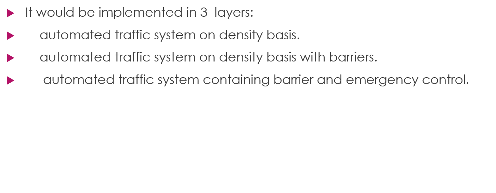

# adaptive-traffic-control
IOT based solution to traffic congestion and chocking in india.

It is a traffic controlling process which involves all the logical thinking and condition used by a TRAFFIC POLICEMAN i.e. HUMAN BRAIN.

At present we use the basic fixed time controlled sequential signal system.
The current traffic system is inefficient due to randomness in the TRAFFIC DENSITY Pattern through out the day.
The flow gets choked when the traffic is not in signal’s fixed sequence.

As far as we have searched and researched on traffic controlling what we found was that this by far one of the highly precised controlling system on the basis of its complexed algorithm and condition consider for implementations. 

                                         

                                          

                                          

